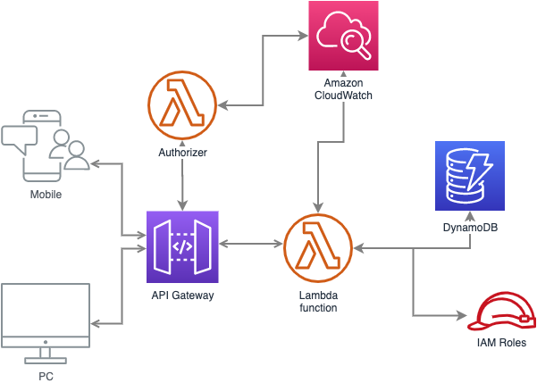

# Ejemplo de AWS CDK con Python

Proyecto de ejemplo presentado a la comunidad de [Python Popayán](https://pythonpopayan.co). La presentación está disponible en [GDocs](https://docs.google.com/presentation/d/1g7HEH5XKyimj9QTbpGuZ860xnWL7GU2yvAQROJW46xg/edit?usp=sharing).

El proyecto consta de una REST API (AWS API Gateway) con un Auhtorizer el cual es una función Lambda (`authorizer.py`) que permita validar si el valor (key) del campo Authorization que se pasa en el header de la petición HTTP es valido o no (en este ejemplo simplemente se compara el valor directamente `auth == 'LtIfelBlD4P938JxeftTNxBM4vn4h2mr'`). Si hay autorización, la petición se renvía a otra función Lambda (`events_info.py`) que es la encargada de hacer un llamado a la base de datos NoSQL Dynamo para consultar todos los datos y retornarlos al cliente. La arquitectura general es la siguiente:



Para iniciar este proyecto se debe:

1. Crear un entorno virtual de Python:

```
$ python3 -m venv .env
```

2. Activar el entorno virtual:

```
$ source .env/bin/activate
```

3. Instalar las dependencias:

```
$ pip install -r requirements.txt
```

4. Probar si todo funciona bien, debe mostrar el CloudFormation Template del proyecto:

```
$ cdk synth
```

## Comandos útiles

- `cdk init --list` plantillas disponibled para crear un proyecto AWS CDK
- `cdk ls` lista todos los Stacks en la aplicación
- `cdk synth` muestra el CloudFormation template
- `cdk deploy` despliega este proyecto en su cuenta AWS
- `cdk diff` compara su Stack local con la nube
- `cdk docs` documentación de CDK
